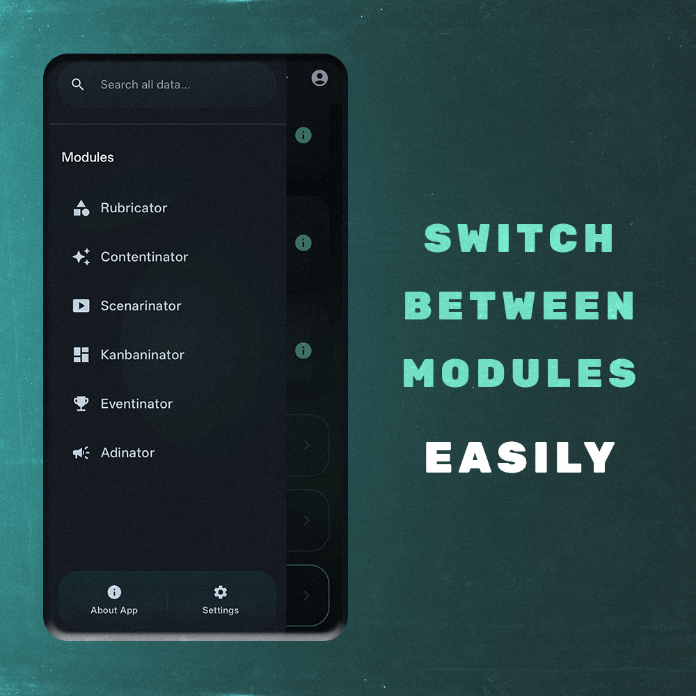
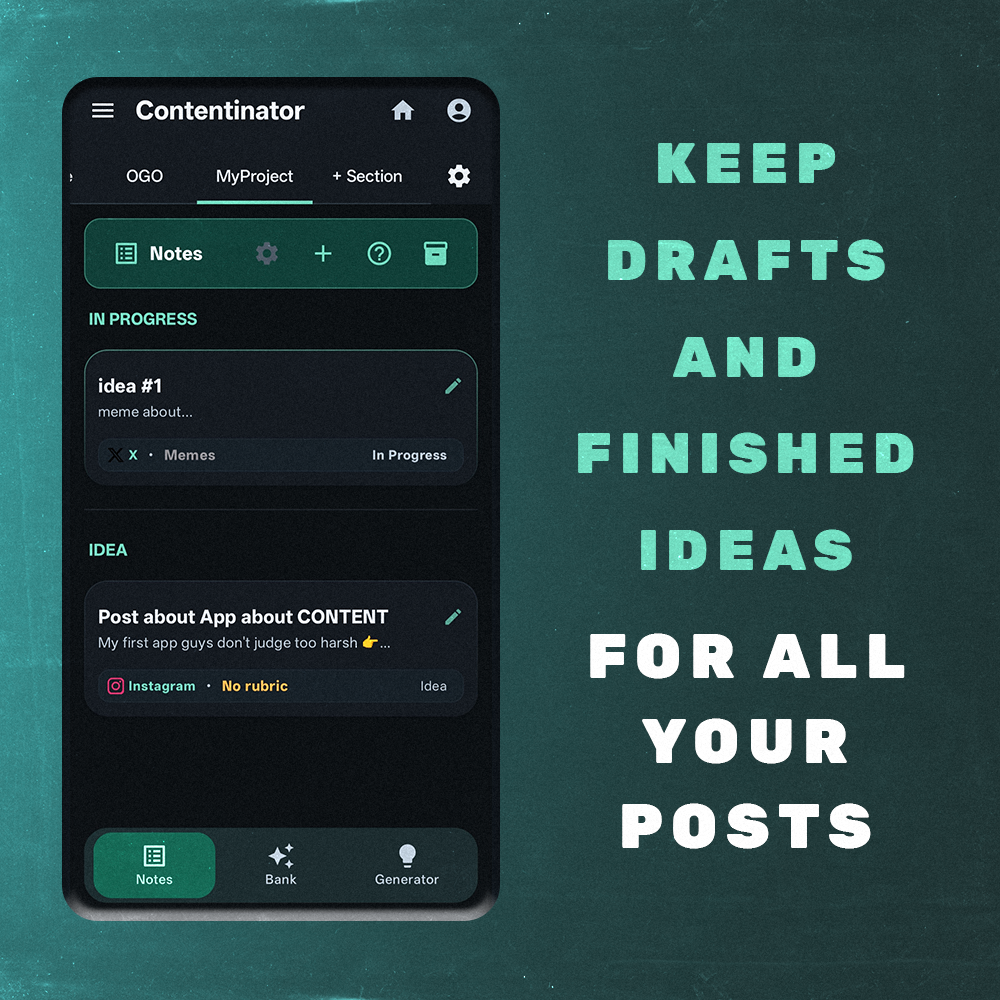
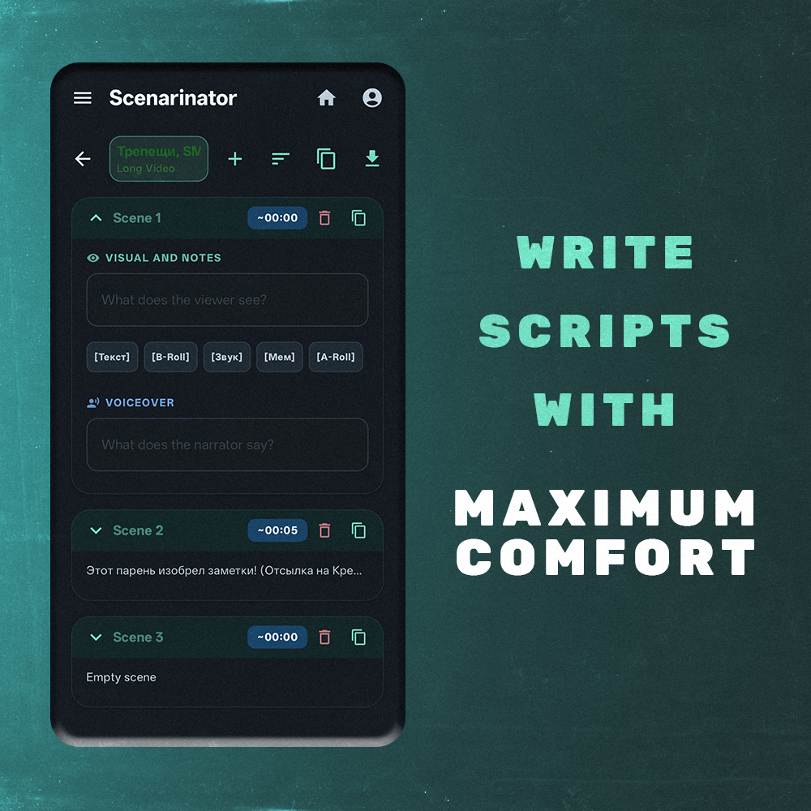
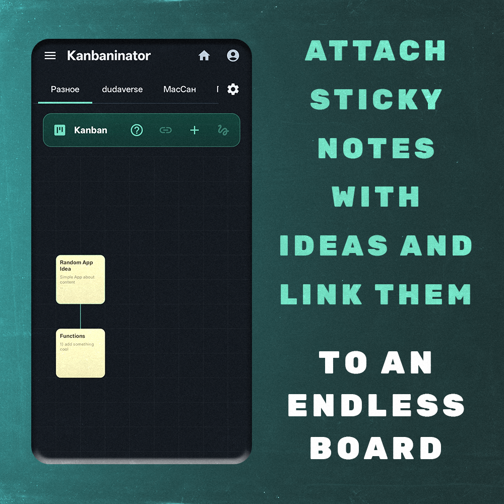
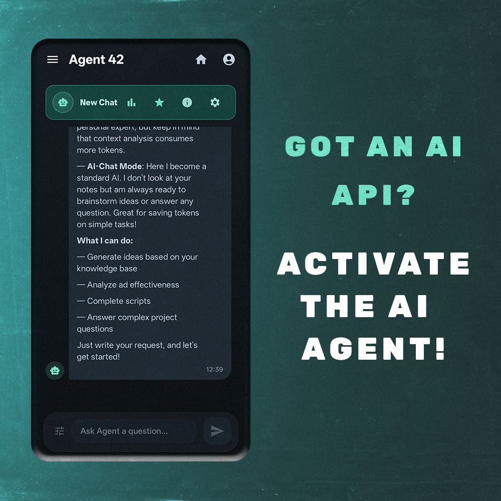
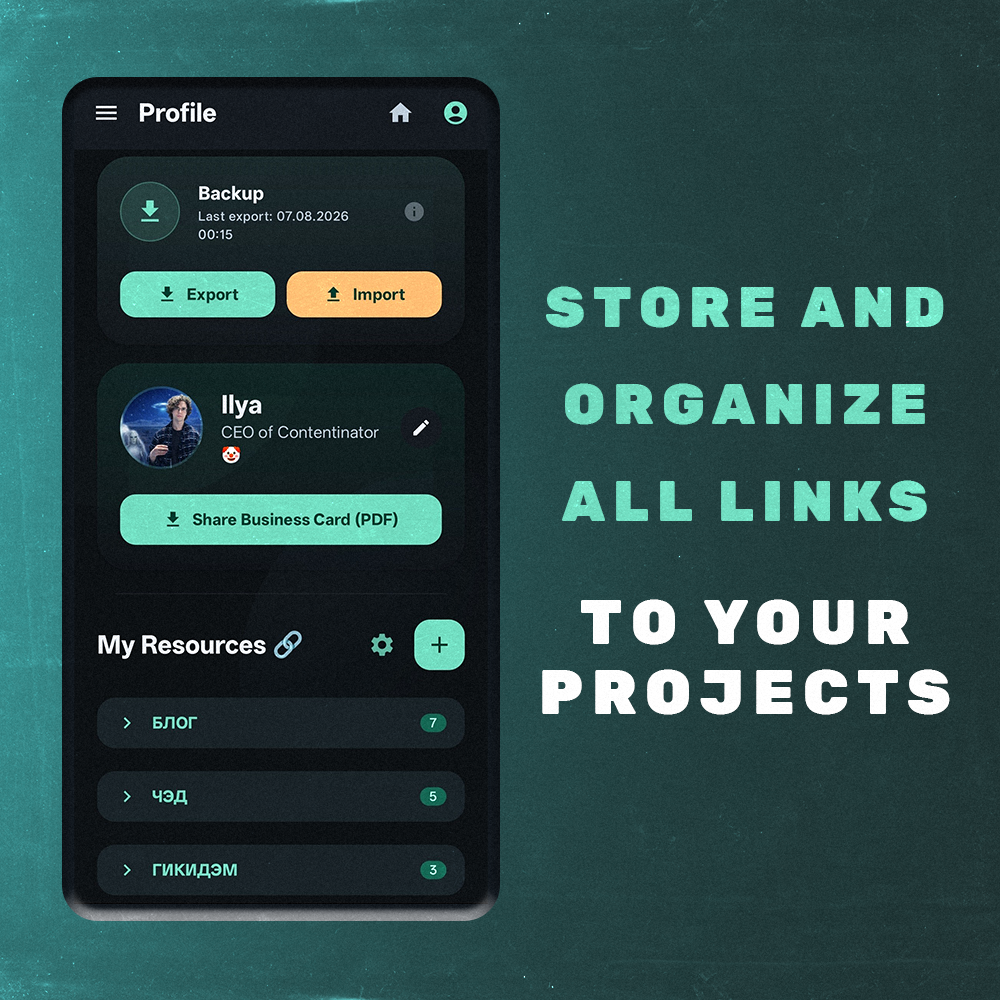
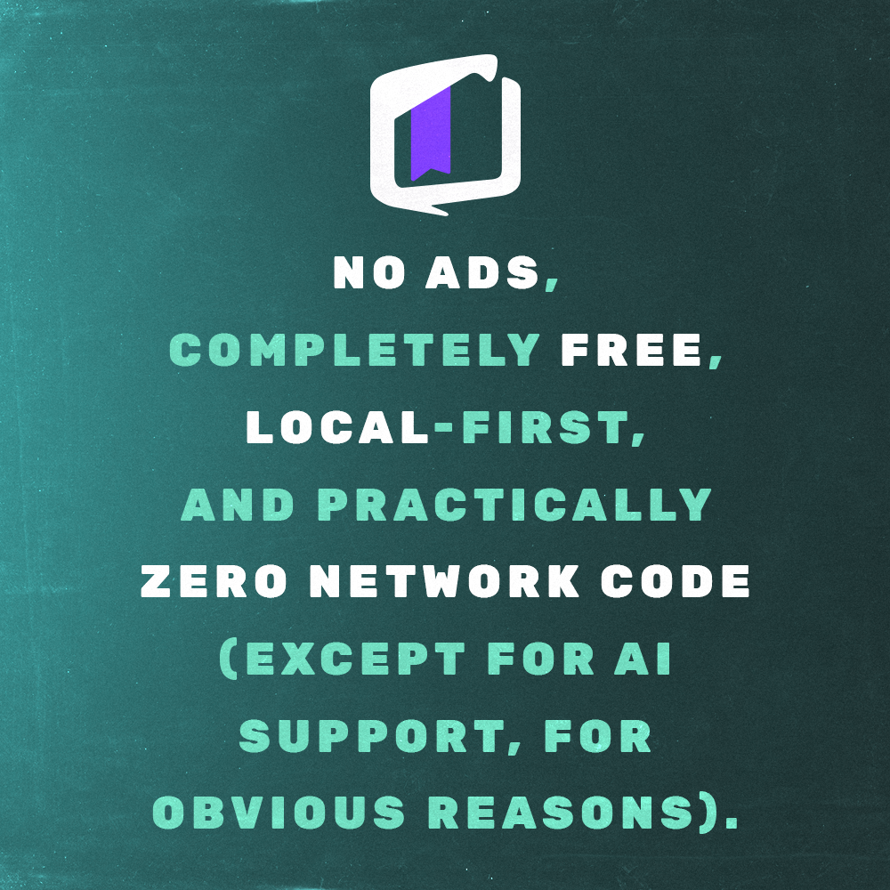

# 📜 Contentinator

[English] | [🇷🇺 Русский](./README.ru.md)

**Your ultimate tool for managing creative ideas.**

---

A logistics hub for creators, SMM managers, and bloggers. Keep your ideas, scripts, rubrics, and ad campaigns organized — all in one app.

---

## 🚀 App Features

  

### 🛠 Content Management Modules
We have divided the workspace into specialized tools so you can focus on what matters most:

  
  

  
  

### 💎 Benefits and Profile

  
  

---

## 📲 Installation Guide

The application is distributed as an APK file directly from the developer.

1. **Download APK**: Click the **Download** button above.
2. **Allow Installation**: When opening the file, go to **Settings** -> **"Allow from this source"**.
3. **Complete Setup**: Confirm the action and enjoy!

> **Requirements:** Android 12.0+ (API 31+). File size ~6 MB.

---

## 🛡 Security and Privacy

The project works locally and does not collect your personal data.
* **SHA-256 Hash (v1.1.1):** `B39D4AC64F7FEF897B89CD7DFBEAFE4E66B357B19C337AA99EF77862FA439FC4`
* **Digital Signature:** Signed by Ilya Sankov (SHA-256 Fingerprint: `5DB67...4C09`)

---

## 💬 Feedback
Found a bug or have a feature request? I'm always open to feedback:
* **Telegram Channel:** [@djilusha](https://t.me/djilusha)
* **Business Card Bot:** [@ilushasankov_bot](https://t.me/ilushasankov_bot)
* **Issues:** [Report a Bug](https://github.com/ilushasankov/contentinator-apk/issues)

---

## 📄 License
Distributed under the **MIT License**. See the [LICENSE](./LICENSE) file for details.
